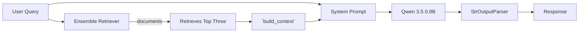

# Smart Amazon Product Query Assistant
Alan Liu, Zhihao Xie

## Overview
This is an end-to-end information retrieval project that finds relevant the Amazon Sports and Outdoors products based on users' natural language query.


### Dataset:

Retrieval system is built based on querying these two Sports_and_Outdoors data on <https://amazon-reviews-2023.github.io/main.html>:
- [Review data](https://mcauleylab.ucsd.edu/public_datasets/data/amazon_2023/raw/review_categories/Subscription_Boxes.jsonl.gz) with 19.6 million user reviews
- [Meta data](https://mcauleylab.ucsd.edu/public_datasets/data/amazon_2023/raw/meta_categories/meta_Sports_and_Outdoors.jsonl.gz) with 1.6 million Amazon items

### Data processing:

This PoC only uses the first 200 entries of sports and outdoors product. First, stream product metadata line-by-line, keep the `parent_asin` field, extracted and combined the following JSON fields into a single field: title, average_rating, features, description, price, categories, and discarded the remaining. Then, stream the product review data and identify only the reviews associated with the `parent_asin` seen above, extracted and merged these fields: title, text, and then group the reviews by `parent_asin` and merge it into a single string. Afterwards, merge the product metadata and review data by `parent_asin` into a single string, and build each entry as a `langchain_core.documents.Document`.

### Retrieval Workflow:
And the retrieval system is based on two algorithms:
1. BM25 keyword-based retrieval system with custom text preprocessing/tokenization functions.
2. Semantic search using HuggingFace embeddings and FAISS-based index.

### RAG Pipeline:

Here we use Ensemble Retriever that combines the retrieval results from BM25 and FAISS-based semantics search, each retrieved up to three documents. It uses the given weights to rank a maximum of six documents. The pipeline extracts top three of the documents, and the context is built with documents' metadata of product title, parent asin, rating, price and page content of product reviews. The context was then embedded into the system prompt and passed to LLM (Qwen 3.5 0.8B). The output is then parsed by the parser and returned to the user as a response.

## Development Setup

### Option 1: To get Ollama Running Locally
1. Download: Go to <ollama.com/download> and install the Ollama for your OS.
2. In your CLI, download the `qwen3.5:0.8b` model by running
```bash
ollama pull qwen3.5:0.8b
```
3. Verify it works by running it and trying a small prompt:
```bash
ollama run qwen3.5:0.8b --think=false
```

### Option 2: Alternatively to get huggingface Running Locally with a Smaller Model
After getting development environment `575-project-query` ready
```bash
huggingface-cli download Qwen/Qwen3.5-0.8B --local-dir ./qwen3.5-0.8b
```

### Get Development Environment Ready
The following pipeline clones the repo, creates a conda environment, downloads and prepares data, builds both keyword-based and semantic search systems, and starts an interactive Streamlit app that enables users to query products:

**Disclaimer**: If `python src/download_data.py` is too slow due to the scale of the data, please manually go to the dataset links above, download the data, and put into the `data/raw` directory.
```bash
git clone git@github.com:UBC-MDS/DSCI_575_project_alnliu11_lightgl.git
cd DSCI_575_project_alnliu11_lightgl

conda env create -f environment.yml
conda activate 575-project-query
```
If you have GPU and cuda-compatiable, then run `conda env create -f environment.yml`.
Otherwise, run `conda env create -f environment_no_cuda.yml`.

Then activate the environment:
```bash
conda activate 575-project-query
```

```bash
python src/download_data.py
python src/rag_pipeline.py

# Might take a while to load
streamlit run app/app.py
```

### Qualitative Evaluation
It is conducted on a set of ten queries, and the results are generated by `python src/retrieval_metrics.py` and stored in the `results/metrics.csv`.
